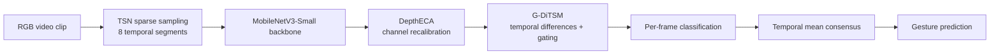

# G-DiTSM: Gated Temporal Shifts with Depth-Efficient Channel Attention for Real-Time Hand-Gesture Interaction

[](https://doi.org/10.1145/3756884.3765982)
[](https://doi.org/10.1145/3756884.3765982)
[](https://pytorch.org/)

Official code repository accompanying the paper:

> **Gated Temporal Shifts with Depth-Efficient Channel Attention for Real-Time Hand-Gesture Interaction**  
> Salah eddine Laidoudi, Madjid Maidi, Samir Otmane  
> *31st ACM Symposium on Virtual Reality Software and Technology (VRST '25)*, Montreal, Canada, 2025.  
> DOI: https://doi.org/10.1145/3756884.3765982

G-DiTSM is a lightweight RGB-only video-classification pipeline for **real-time dynamic hand-gesture recognition**, with mixed-reality (MR) interaction as the main target application. The method combines sparse temporal sampling, a MobileNetV3 backbone, efficient channel attention, and gated temporal shifts to capture motion while retaining a small computational footprint.

---

## Highlights

- **RGB only** — no depth sensor, skeleton tracker, optical flow, or additional modality is required.
- **8-frame sparse sampling** using the Temporal Segment Network (TSN) paradigm.
- **Gated Discriminative Temporal Shift Module (G-DiTSM)** for content-adaptive temporal modeling.
- **Depth-Efficient Channel Attention (DepthECA)** for lightweight feature recalibration.
- Designed for **real-time and resource-constrained MR / XR systems**.
- Evaluated on the **20BN-Jester** hand-gesture benchmark with 27 gesture classes.
- Paper result: **95.34% Top-1**, **99.80% Top-5**, **2.65 M parameters**, and **0.084 GFLOPs**.

---

## Method overview

The network starts from a lightweight 2D MobileNetV3 backbone and adds temporal reasoning without relying on a heavy 3D CNN or video transformer.



### G-DiTSM

G-DiTSM extends discriminative temporal shifting with two learnable components:

1. **First-order temporal differences** are computed for forward- and backward-shifted channel groups.
2. A **depthwise 3D temporal convolution** with a `(3, 1, 1)` kernel aggregates local motion information.
3. An **SE-style channel gate** learns which temporal channels should contribute to the output.
4. The temporal representation is merged through **gated residual fusion**.

The implementation is in [`ops/gated_dtsm.py`](ops/gated_dtsm.py).

### DepthECA

DepthECA provides lightweight feature recalibration inside the MobileNetV3 backbone. The repository contains the corresponding MobileNetV3 attention variants in:

- [`archs/mobilenet_v3_deptheca.py`](archs/mobilenet_v3_deptheca.py)
- [`archs/mobilenet_v3_deptheca_mega.py`](archs/mobilenet_v3_deptheca_mega.py)

The full repository configuration exposed by the TSN wrapper is `mobilenetv3_deptheca_mega`.

---

## Results

The following values are the results reported in the VRST 2025 paper on **20BN-Jester** using an 8-frame input setting.

### Comparison with representative methods

| Model | Top-1 (%) | Top-5 (%) | Params (M) | FLOPs (G) | Memory (MB) |
|---|---:|---:|---:|---:|---:|
| **G-DiTSM + DepthECA (Ours)** | **95.34** | **99.80** | **2.65** | **0.084** | **7.9** |
| ESTI | 94.47 | 99.63 | 27.11 | 38.00 | 101 |
| ACTION-Net | 93.53 | 99.55 | 2.28 | 15.75 | 12 |
| STASTA | 92.62 | 99.49 | 24.80 | 48.16 | 95 |
| TSM | 89.80 | 96.42 | 23.56 | 39.66 | 91 |
| ViViT-L | 81.70 | 93.80 | 31.80 | 144.00 | 120 |
| TSN | 81.00 | 99.00 | 23.68 | 33.00 | 94 |

### Ablation study

| Variant | Top-1 (%) | Top-5 (%) | Params (M) | FLOPs (G) |
|---|---:|---:|---:|---:|
| MobileNetV3 baseline | 75.54 | 97.80 | 2.50 | 0.06 |
| + DepthECA | 80.12 | 98.62 | 2.55 | 0.07 |
| + TSM | 93.75 | 99.28 | 2.50 | 0.06 |
| + Gated-DiTSM | 94.41 | 99.67 | 2.60 | 0.08 |
| + DepthECA + TSM | 94.78 | 99.72 | 2.60 | 0.08 |
| **+ DepthECA + Gated-DiTSM** | **95.34** | **99.80** | **2.65** | **0.084** |

> **Note:** These are the values reported in the paper; they are not automatically recomputed by this repository.

---

## Dataset

Experiments use the **20BN-Jester** dataset, a large-scale RGB hand-gesture dataset containing **148,092 clips across 27 classes**.

Paper split statistics:

| Split | Clips |
|---|---:|
| Train | 118,562 |
| Validation | 14,787 |
| Test | 14,743 |
| **Total** | **148,092** |

The dataset is not redistributed in this repository. Obtain it under the dataset provider's terms and place the extracted frame folders and annotation CSV files under `datas/jester/`.

The data loader expects frames to be named as:

```text
00001.jpg
00002.jpg
00003.jpg
...
```

### Expected layout

```text
G-DiTSM/
├── archs/
├── ops/
├── datas/
│   ├── __init__.py
│   ├── dataset.py
│   ├── dataset_config.py
│   └── jester/
│       ├── 20bn-jester-v1/
│       │   ├── 1/
│       │   │   ├── 00001.jpg
│       │   │   ├── 00002.jpg
│       │   │   └── ...
│       │   ├── 2/
│       │   └── ...
│       ├── jester-v1-labels.csv
│       ├── jester-v1-train.csv
│       ├── jester-v1-validation.csv
│       ├── jester-v1-test.csv
│       ├── category.txt
│       ├── train_videofolder.txt
│       ├── val_videofolder.txt
│       └── test_videofolder.txt
├── main.py
├── generate_label.py
├── camera.py
└── ...
```

Generate the list files used by the TSN loader with:

```bash
python generate_label.py
```

Each training/validation entry generated by the script has the form:

```text
/path/to/video_frames number_of_frames class_index
```

and each test entry has the form:

```text
/path/to/video_frames number_of_frames
```

---

## Installation

Clone the repository:

```bash
git clone https://github.com/saydek217/G-DiTSM.git
cd G-DiTSM
```

Create a virtual environment:

```bash
python -m venv .venv

# Linux / macOS
source .venv/bin/activate

# Windows PowerShell
# .\.venv\Scripts\Activate.ps1
```

Install a recent, mutually compatible PyTorch / torchvision environment for your CUDA or CPU setup, then install the remaining dependencies:

```bash
pip install torch torchvision
pip install numpy pillow opencv-python tensorboard
```

### Important dependency note

The current [`requirements.txt`](requirements.txt) contains legacy versions inherited from the older TSM codebase (`torch==1.2.0`, `torchvision==0.4.0`). Those versions predate the MobileNetV3 APIs used by the current implementation and should therefore **not be treated as the environment specification for the full G-DiTSM model**.

For reproducible release use, it is recommended to replace the legacy file with versions matching the environment used for the final experiments.

---

## Repository structure

```text
.
├── archs/
│   ├── mobilenet_v2.py
│   ├── mobilenet_v3_deptheca.py
│   └── mobilenet_v3_deptheca_mega.py
├── ops/
│   ├── attention_shift.py
│   ├── basic_ops.py
│   ├── dtemporal_shift.py
│   ├── gated_dtsm.py
│   ├── models.py
│   ├── temporal_shift.py
│   ├── transforms.py
│   └── utils.py
├── camera.py              # Real-time webcam inference
├── dataset.py             # Jester TSN dataset loader
├── dataset_config.py      # Dataset paths
├── generate_label.py      # Generates train/val/test frame-list files
├── main.py                # Training, validation, and test entry point
├── train.sh               # Legacy/baseline training command
├── test.sh                # Legacy/baseline test command
├── categories.txt         # Jester gesture labels
└── requirements.txt
```

---

## Training

The paper uses **8 temporal segments**. The repository's full MobileNetV3 + attention + gated temporal-shift configuration can be selected with:

```bash
python main.py \
    --mode train \
    --arch mobilenetv3_deptheca_mega \
    --num_segments 8 \
    --batch_size 16 \
    --epochs 30 \
    --lr 0.01 \
    --warmup_epochs 5 \
    --lr_type cosine \
    --shift \
    --shift_div 8
```

Relevant options are defined in [`options.py`](options.py), including:

```text
--num_segments
--batch_size
--epochs
--lr
--warmup_epochs
--lr_type {cosine,step}
--shift
--shift_div
--dropout
--workers
--root_log
--root_model
```

Checkpoints are written under:

```text
checkpoint/<experiment_name>/
```

and TensorBoard/log outputs under:

```text
log/<experiment_name>/
```

To monitor TensorBoard:

```bash
tensorboard --logdir log
```

### Baseline scripts

The bundled [`train.sh`](train.sh) and [`test.sh`](test.sh) currently select:

```text
--arch mobilenetv2
```

and therefore correspond to a **MobileNetV2 + TSM baseline configuration**, not the full MobileNetV3 + DepthECA + G-DiTSM paper model. Update the architecture argument before using those scripts for the full model.

---

## Evaluation / test prediction

After training, `main.py` loads the best checkpoint from:

```text
checkpoint/<experiment_name>/ckpt.best.pth.tar
```

Run the full-model configuration in test mode with:

```bash
python main.py \
    --mode test \
    --arch mobilenetv3_deptheca_mega \
    --num_segments 8 \
    --shift \
    --shift_div 8
```

Predictions are written to a `result.csv` file inside the experiment log directory.

---

## Real-time webcam demo

[`camera.py`](camera.py) implements a real-time RGB webcam loop with:

- an 8-frame temporal queue,
- softmax prediction,
- exponential moving-average probability smoothing,
- confidence thresholds,
- dwell-in / dwell-out filtering for stable gesture labels,
- CPU or CUDA execution,
- optional FP16 inference on CUDA.

Example:

```bash
python camera.py \
    --ckpt path/to/ckpt.best.pth.tar \
    --labels datas/jester/category.txt \
    --device auto \
    --num-segments 8
```

Useful options:

```text
--cam
--device {auto,cpu,cuda}
--no-fp16
--ema-alpha
--dwell-in
--dwell-out
--thr-in
--thr-out
--num-segments
```

Press `q` or `Esc` to stop the demo.

> **G-DiTSM checkpoint note:** when loading a checkpoint trained with gated temporal shifts, the TSN instance used for inference must also be created with `is_shift=True` and the same `shift_div` used during training. Verify this in `camera.py` before evaluating a G-DiTSM checkpoint.

---

## Current repository notes

Before using the repository as a fully reproducible public release, please check the following small code/layout inconsistencies:

1. `main.py` currently imports:
   ```python
   from datas.dataset import TSNDataSet
   from datas import dataset_config
   ```
   while `dataset.py` and `dataset_config.py` are currently stored at repository root. Either move them into a `datas/` Python package or update the imports.

2. `train.sh` and `test.sh` currently use `mobilenetv2`, whereas the paper's proposed architecture is based on MobileNetV3 with DepthECA and G-DiTSM.

3. `requirements.txt` pins an old PyTorch/torchvision stack that is incompatible with the MobileNetV3 APIs used by the current code.

4. The repository does not currently include the trained paper checkpoint. The paper states that code, trained weights, and benchmark scripts can be provided upon request.

Addressing these points before tagging a release will make the repository substantially easier to reproduce.

---

## Scope and limitations

The paper evaluates the approach on Jester, whose recordings are **front-facing rather than HMD-peripheral/egocentric**. The dataset is therefore used as a proxy for MR command gestures rather than a direct headset-view benchmark.

The reported FLOPs indicate a very small compute budget, but actual throughput depends on deployment hardware. The paper notes that direct profiling on XR-class SoCs remains future work.

---

## Citation

If this code or paper is useful in your research, please cite:

```bibtex
@inproceedings{laidoudi2025gditsm,
  author    = {Salah eddine Laidoudi and Madjid Maidi and Samir Otmane},
  title     = {Gated Temporal Shifts with Depth-Efficient Channel Attention for Real-Time Hand-Gesture Interaction},
  booktitle = {Proceedings of the 31st ACM Symposium on Virtual Reality Software and Technology (VRST '25)},
  year      = {2025},
  address   = {Montreal, QC, Canada},
  publisher = {ACM},
  doi       = {10.1145/3756884.3765982}
}
```

---

## Acknowledgements

This repository builds on ideas and code structure from the **Temporal Shift Module (TSM)** ecosystem:

- Ji Lin, Chuang Gan, and Song Han, *TSM: Temporal Shift Module for Efficient Video Understanding*, ICCV 2019.
- https://github.com/mit-han-lab/temporal-shift-module

The experiments use the **20BN-Jester** dataset:

- Joanna Materzynska, Guillaume Berger, Ingo Bax, and Roland Memisevic, *The Jester Dataset: A Large-Scale Video Dataset of Human Gestures*, ICCVW 2019.

---

## License

No explicit license file is currently included in this repository.

If you intend others to reuse, modify, or redistribute the code, add an appropriate `LICENSE` file and make sure the license is compatible with any upstream code that was reused or adapted.
